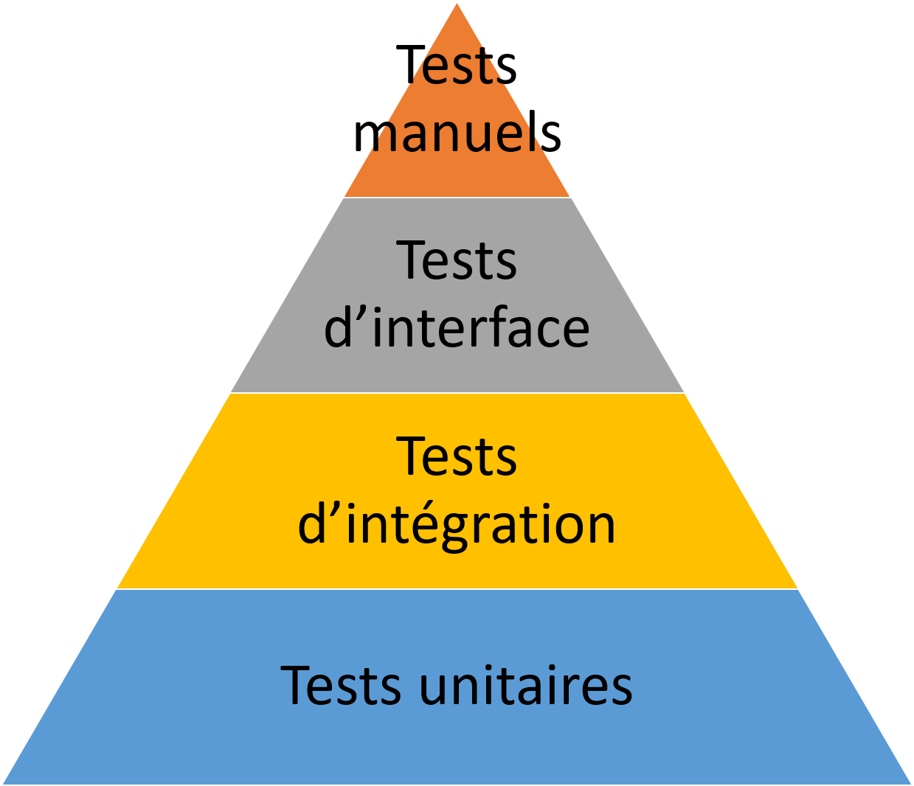

# Document de stratégie de tests

1: Portée et aperçu
Le présent document a pour but de montrer la statégie et la vision qui nous ont permis de mettre en place des tests pour l'API Spring Boot à même de réduire fortmenent les risques de régression

2: Approche de test
Nous avons décider de mettre en place 3 types de tests:
 - Les tests unitaires qui viennent vérifier que chaque élément constitutif de l'application fonctionne normalement
 - Les tests d'intégration qui simulent le coportement d'un utilisateur pour appeler un endpoint
 - Les test end-to-end qui simulent le parcours d'un utilisateur dans son entièreté.

Ces niveaux de tests se répartissent selon le principe de la pyramide des tests avec beaucoup de tests unitaires très simple à mettre en place, un peu moins de tests d'intégration un peu plus complexes, et encre un peu moins de tests end-to-end

3: Environnement de test
Notre environement de test a pour but de s'approcher de celui de l'Api en production. Il s'agit donc d'un enviroment Spring boot de test auquel nous ajoutons des objets en bases de données à chaque éxécution.

4: Outils de test
Nous utiliserons spring-boot-starter-test afin d'éxécuter les tests et SonarQube afin de calculer le code coverage
