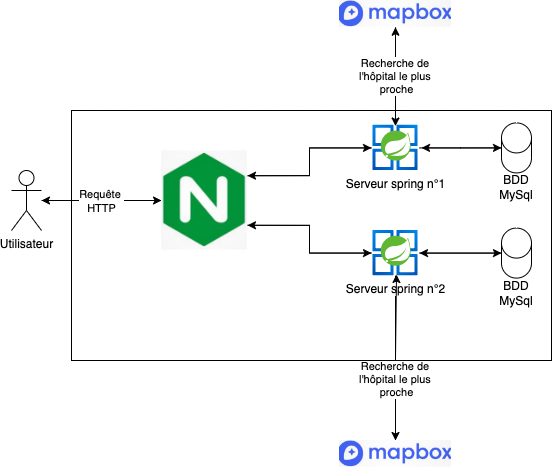

# Éléments de bases

Tout au long de la mise de la mise en place de notre PoC nous avons eu l'ocasion de développer des élements qui pourront servir à l'équipe en charge de développer l'API de prise en charg des patients de MedHead
Ces éléments peuvent avoir une valeur pour le développement de la futur application et il nous parait important de les mentioner

1: API Spring Boot:
Nous avons pu développer lors de notre PoC ue API Spring Boot qui comporte un seul endpoint de création d'une réservation de lit ainsi que le code nécéssaire au fonctionement de celui ci dans les différentes couches de l'application. Nous avons aussi intégré les tests relatifs au fonctionement du endpoint. Cette API bien que rudimentaire pourrait aider les développeurs dans les premières étapes de la mise en place de l'application.

2: Pipelines GitLab:
Lors du dévelppement de notre PoC nous avons pu mettre en place des pipelines qui nous permettent de créer autmatiquement une image Docker nouvelle à chaque fois que du nuveau code arrive sur la branche master de notre repository. Cette pipelines pourra servir pour le déploiement de notre nouvelle application étant donné que les technologies employées seront les mêmes.

3: Travaux architecturaux:
Nous avons également pu réaliser des travaux de définition de l'architecture de l'API de notre PoC qui pourront être utiles

**BDD de l'API:**

Afin de respecter les exigences de l’application cible nous mettrons en place une base de donnée de recette composée d'hôpitaux fictifs possédant telles ou telles spécialisations. Lorsqu’un nouveau patient entre dans le système, l’équipe de secours renseigne la spécialité dans laquelle celui-ci devra être pris en charge et s’il nécessite des options particulières dans sa chambre. À partir des informations saisies et de la position GPS du patient, une demande de réservation est envoyée à l'hôpital concerné pour la chambre la plus appropriée.

**Couche applicative de l'API:**

Ce schéma montre les différents composants de l’application de recette qui nous permettront de prouver la faisabilité de votre projet. Lorsque l’utilisateur fait une requête pour une réservation, le serveur SpringBoot communique avec le BDD MySQL avec le protocole SSL afin de faire des actions de CRUD sur la base de données. De plus, le serveur opourbtient l’information sur l'hôpital le plus proche avec un serveur de geocoding installé sur le cluster. Ce serveur de Geocoding verra ses données mise à jour à raison d’une fois par semaine par un jo qui ira chercher les informations sur le site GeoFabrik

**Couche d'infrastructure de l'API:**

La couche infrastructure repose sur l'utilisation de l'outil Docker Swarm afin de coordonner les différents composants qui nous permettent de faire fonctionner notre application. Elle sera composées de 3 nodes qui permettront de fournir une haute disponibilité de l'application.
