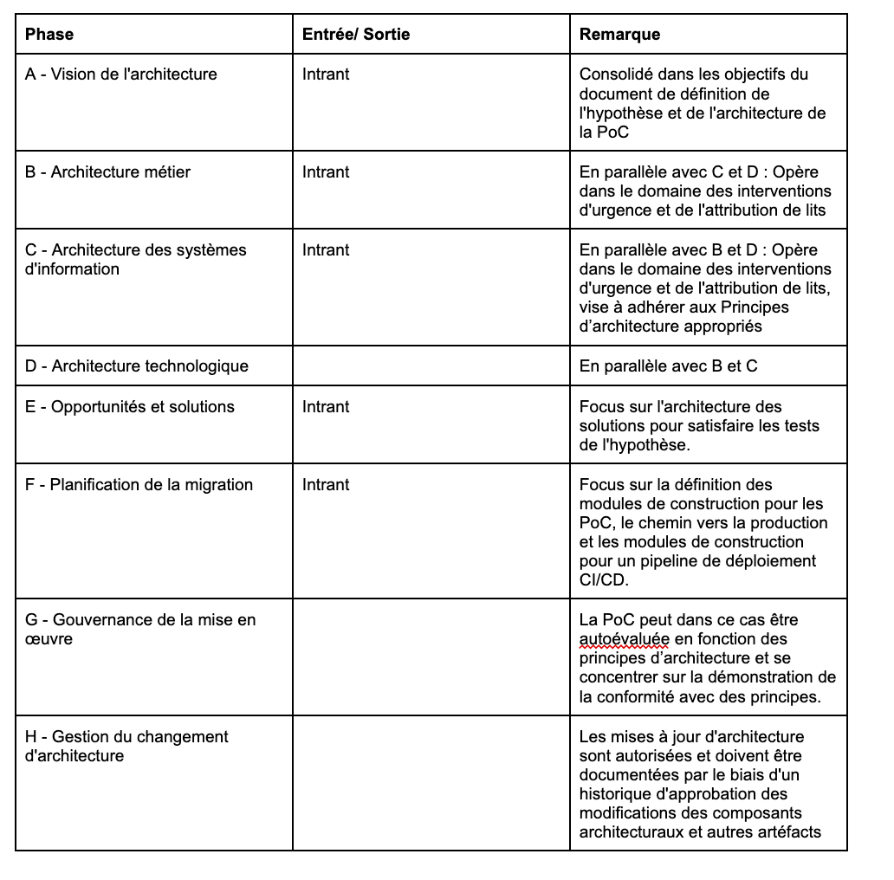

# Énoncé des travaux d'architecture
Le présent document a pour but de rapeler les travaux d'architecture mis en place tout au long de cet projet, leur portée ainsi que le rôle des différentes parties prennantes dans leur réalisation

**Demande de projet d’architecture et contexte:**
Un consortium de quatre sociétés de premier plan s'est réuni pour consolider les efforts, les données, les applications et les feuilles de route de chacune afin de développer une plateforme de nouvelle génération centrée sur le patient et capable d'améliorer les soins de base proposés - tout en étant réactive, opérationnelle en temps réel et capable de prendre des décisions dans les situations d'urgence, en prenant en compte l’ensemble des données. L'application Spring boot mise en place lors du développement de notre PoC a pour but de créer un environnement conforme à celui de l’application cible qui nous permettra de faire des exécution dans des conditions semblables.

**Description et portée du projet d’architecture:**
Le but de ce PoC est de vérifier que nous pouvons à toutes les conditions sine qua none au bon fonctionement de notre future API de prise en charge des patients. Le sous-système d'intervention d'urgence en temps réel est destiné à recevoir une ou plusieurs spécialités médicales (voir les Données de référence sur les spécialités) et une banque de données d'informations récentes sur les hôpitaux afin de suggérer l'hôpital le plus proche offrant un lit disponible, associé à une ou plusieurs spécialisations correspondantes. Le lieu de l'incident d'urgence doit également être fourni.

**Vue d’ensemble de la vision de l’architecture:**
Nous définissons l'architecture de l'API mise en place dans le PoC dans le doucument décrivant les élements architecturaux de base

**Procédures spécifiques de changement de périmètre:**
Dans le cadre d'un changement de périmètre du projet nous nous aligneront sur les principes de la méthodologie agile en privilégiant la communication entre les membres de l'équipe de développement et la direction de projet. Des réunions régulières seront néssécaires pour recadrer le projet ainsi que pour éviter tout conflits au sein de l'équipe.

**Rôles, responsabilités et livrables:**
Dans le but de mettre au clair les rôles des différentes parties prennantes du projets, nous les avons définis dans une matrice RACI visible ci-dessous:

Afin d'être en accord avec les principes de la méthodologie TOGAF nous avons défini les différentes étapes de conception de l'architecture de notre API.

**Critères et procédures d’acceptation:**
Afin de pouvoir commencer le développpement de l'API de prise en charge des patients il faudra que notre PoC ai d'abord démontré la faisabilité de chaque contrainte du projet, celles-ci ayant été définies dans le document des [hypopthèses de validation](../Hypothese%20de%20validation/README.md)

**Plan et calendrier du projet d’architecture:**

**Approbations:**
En plus de respecter les KPIs fixées dans les [hypopthèses de validation](../Hypothese%20de%20validation/README.md), le projet devra être validé par l'équipe de direction de projet afin de pouvoir commencer.
