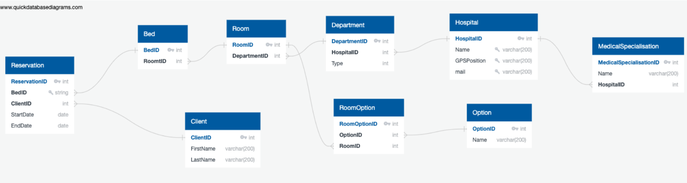
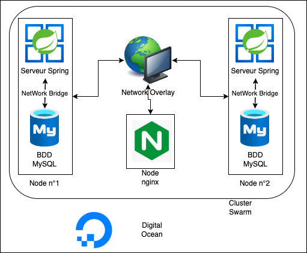

# Énoncé des travaux d'architecture
L'application Spring boot mise en place lors du développement de notre PoC a pour but de créer un environnement conforme à celui de l’application cible qui nous permettra de faire des exécution dans des conditions semblables.

**BDD de l'API:**

Afin de respecter les exigences de l’application cible nous mettrons en place une base de donnée de recette composée d'hôpitaux fictifs possédant telles ou telles spécialisations. Lorsqu’un nouveau patient entre dans le système, l’équipe de secours renseigne la spécialité dans laquelle celui-ci devra être pris en charge et s’il nécessite des options particulières dans sa chambre. À partir des informations saisies et de la position GPS du patient, une demande de réservation est envoyée à l'hôpital concerné pour la chambre la plus appropriée.

**Couche applicative de l'API:**

Ce schéma montre les différents composants de l’application de recette qui nous permettront de prouver la faisabilité de votre projet. Lorsque l’utilisateur fait une requête pour une réservation, le serveur SpringBoot communique avec le BDD MySQL avec le protocole SSL afin de faire des actions de CRUD sur la base de données. De plus, le serveur opourbtient l’information sur l'hôpital le plus proche avec un serveur de geocoding installé sur le cluster. Ce serveur de Geocoding verra ses données mise à jour à raison d’une fois par semaine par un jo qui ira chercher les informations sur le site GeoFabrik

**Couche d'infrastructure de l'API:**

La couche infrastructure repose sur l'utilisation de l'outil Docker Swarm afin de coordonner les différents composants qui nous permettent de faire fonctionner notre application. Elle sera composées de 3 nodes qui permettront de fournir une haute disponibilité de l'application.

